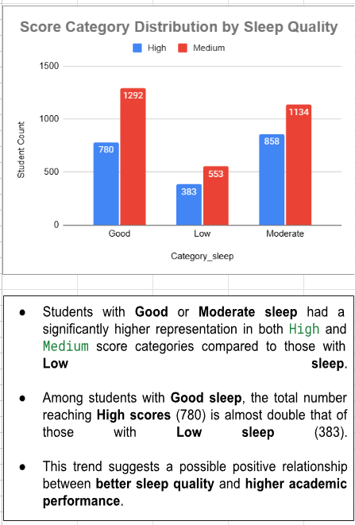

# student-performance-analysis-with-google-sheet
📊 A data analysis project exploring how lifestyle, academic, and socioeconomic factors affect student performance using Google Sheets.

🌟 Project Objectives

Analyze the impact of sleep quality, stress level, extracurricular activities, and more on academic performance

Explore performance differences by department, parental education, income level, and study habits

Use Google Sheets functions and charts to visualize relationships and draw insights

🛠 Tools & Techniques

Google Sheets: Pivot tables, conditional formatting, charts, COUNTIFS/IFS formulas, filters

Data Cleaning: Standardized labels, removed unnecessary columns, validated entries

Charts: Pie charts, stacked bar charts, summary tables

Functions: COUNTIFS, IFS, AVERAGEIF, COUNTBLANK, COUNTIF, FILTER

📈 Key Visualizations

Sleep Quality vs Academic Score

Stress Levels and Score Distribution

Parent Education Level and Performance

Study Hours by Department and Score Category

Summary Table showing % of High Scores per Factor

📊 Example Visualization

(Sleep Quality vs Score Category)

📌 Files
📄 [🎓 Student Performance Data Analysis Project – PDF](./Student_Performance_Data_Analysis_Project.pdf)

📊 Google Sheets (View-only)
🔗 [Click here to view the Google Sheets file (read-only)](https://docs.google.com/spreadsheets/d/1n372in6ctYEiYrRM1ViH4pdKvQxhd38I02yqBKSrz6s/edit?usp=sharing)

🗂️ Data Source
This project is based on a fictional dataset of 5,000 students created for educational analysis purposes.
📂 [Source Data – CSV](./Students_Grading_Dataset.csv)

📢 Highlights

"Good Sleep" shows the strongest link to high academic performance

Stress affects scores in complex ways — both low and high stress levels relate to better scores

Parental education and family income have limited impact

Extracurriculars show slightly lower performance, but may contribute to non-academic development

The project was built entirely in Google Sheets with clear visual storytelling and clean structure

